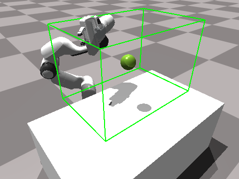
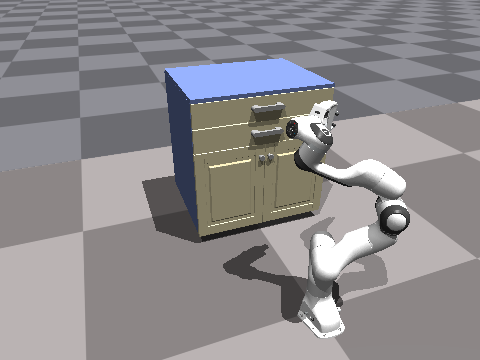
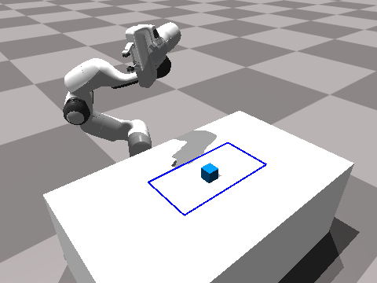
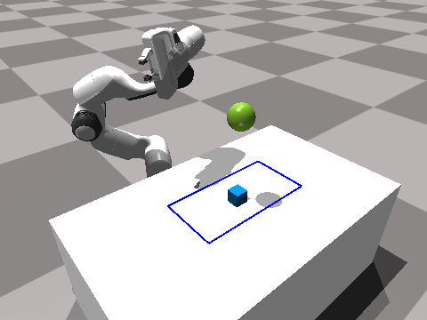
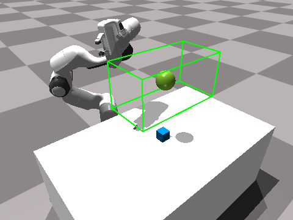
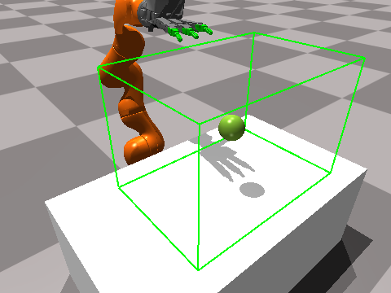
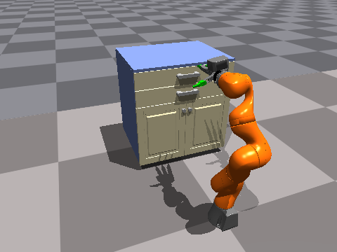
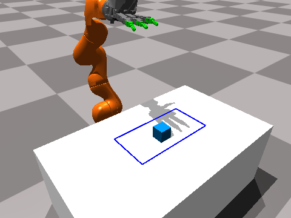
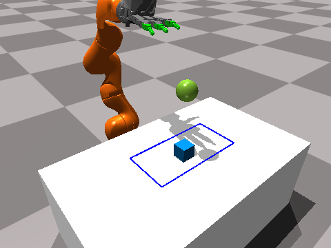
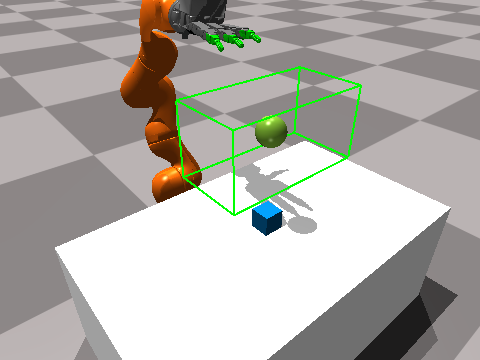

# PixMC Benchmark Suite

**Robots:**

- [Franka](TASKS.md#franka-robot)
- [Kuka](TASKS.md#kuka-robot)

**Tasks:**

- [FrankaReach](TASKS.md#frankareach-task)
- [FrankaCabinet](TASKS.md#frankacabinet-task)
- [FrankaPick](TASKS.md#frankapick-task)
- [FrankaMove](TASKS.md#frankamove-task)
- [KukaReach](TASKS.md#kukareach-task)
- [KukaCabinet](TASKS.md#kukacabinet-task)
- [KukaPick](TASKS.md#kukapick-task)
- [KukaMove](TASKS.md#kukamove-task)

## Franka Robot

**Robot randomization:**

```
init_dof_pos = [1.157, -1.066, -0.155, -2.239, -1.841, 1.003, 0.469, 0.035, 0.035]
dof_pos = init_dof_pos + uniform(-0.125, 0.125)
```

**Proprioceptive observations:**

| index | type    | description |
|:------|:--------|:------------|
| 0:7   | dof pos | arm         |
| 7:9   | dof pos | fingers     |
| 9:16  | dof vel | arm         |
| 16:18 | dof vel | fingers     |

**Image observations:**

<div align="left">
  <image src="assets/ims/franka_ego_1.png" width="168px" />
  <image src="assets/ims/franka_ego_2.png" width="168px" />
  <image src="assets/ims/franka_ego_3.png" width="168px" />
  <p></p>
</div>

Egocentric `224x224x3` RGB image (examples shown above).

**Action space:**

| index | type          | description |
|:------|:--------------|:------------|
| 0:7   | delta dof pos | arm         |
| 7:9   | delta dof pos | fingers     |

## Kuka Robot

**Robot randomization:**

```
init_dof_pos = [
    0.0, -0.4, 0.0, -1.0, 0.0, 1.0, 0.0,
    0.0, 0.0, 0.0, 0.0,
    0.0, 0.0, 0.0, 0.0,
    0.0, 0.0, 0.0, 0.0,
    0.0, 0.0, 0.0, 0.0
]
dof_pos = init_dof_pos + uniform(-0.125, 0.125)
```

**Proprioceptive observations:**

| index | type    | description   |
|:------|:--------|:--------------|
| 0:7   | dof pos | arm           |
| 7:11  | dof pos | index finger  |
| 11:15 | dof pos | middle finger |
| 15:19 | dof pos | ring finger   |
| 19:23 | dof pos | thumb         |
| 23:30 | dof vel | arm           |
| 30:34 | dof vel | index finger  |
| 34:38 | dof vel | middle finger |
| 38:42 | dof vel | ring finger   |
| 42:46 | dof vel | thumb         |

**Image observations:**

<div align="left">
  <image src="assets/ims/kuka_ego_1.png" width="168px" />
  <image src="assets/ims/kuka_ego_2.png" width="168px" />
  <image src="assets/ims/kuka_ego_3.png" width="168px" />
  <p></p>
</div>

Egocentric `224x224x3` RGB image (examples shown above).

**Action space:**

| index | type          | description   |
|:------|:--------------|:--------------|
| 0:7   | delta dof pos | arm           |
| 7:11  | delta dof pos | index finger  |
| 11:15 | delta dof pos | middle finger |
| 15:19 | delta dof pos | ring finger   |
| 19:23 | delta dof pos | thumb         |

## FrankaReach Task


**Description:**

Reach the goal (green sphere) with the robot hand.

**Goal randomization:**



```
init_goal_pos = [0.55, 0.0, 0.7]
goal_pos[0] = init_goal_pos[0] + uniform(-0.2, 0.2)
goal_pos[1] = init_goal_pos[1] + uniform(-0.3, 0.3)
goal_pos[2] = init_goal_pos[2] + uniform(-0.2, 0.2)
```

**Oracle observations:**

| index | type | description     |
|:------|:-----|:----------------|
| 0:3   | xyz  | hand pos        |
| 3:6   | xyz  | goal pos        |
| 6:9   | xyz  | hand to goal    | 

**Reward function:**

```
reward = 0.08 * goal_dist \
    + 0.4 * near_goal_bonus \
    - 0.01 * action_penalty
```

**Success:**

10 consecutive timesteps with hand at the goal.

## FrankaCabinet Task


**Description:**

Open the top drawer of the cabinet.

**Cabinet randomization:**



```
init_cabinet_pos = [0.05, 0.0, 0.45]
cabinet_pos[0] = init_cabinet_pos[0] + uniform(-0.075, 0.075)
cabinet_pos[1] = init_cabinet_pos[1] + uniform(-0.075, 0.075)
cabinet_pos[2] = init_cabinet_pos[2] + uniform(-0.05, 0.05)
```

**Oracle observations:**

| index | type | description       |
|:------|:-----|:------------------|
| 0:3   | xyz  | lfinger pos       |
| 3:6   | xyz  | rfinger pos       |
| 6:9   | xyz  | handle pos        | 
| 9:12  | xyz  | lfinger to handle |
| 12:15 | xyz  | rfinger to handle |
| 15:16 | d    | handle to open    |

**Reward function:**

```
reward = 0.06 * lfinger_handle_dist \
    + 0.06 * rfinger_handle_dist \
    + 1.0 * near_handle_bonus \
    + 2.0 * drawer_open_bonus \
    + 6.0 * open_dist \
    + 3.0 * grasp_pose_bonus \
    + 2.0 * fully_open_bonus \
    - 0.01 * action_penalty
```

**Success:**

10 consecutive timesteps with fully open drawer and gripper at handle.

## FrankaPick Task


**Description:**

Pick up the blue cube and lift it above the table.

**Object randomization:**



```
init_object_pos = [0.5, 0.0, 0.4225]
object_pos[0] = init_object_pos[0] + uniform(-0.1, 0.1)
object_pos[1] = init_object_pos[1] + uniform(-0.2, 0.2)
```

**Oracle observations:**

| index | type | description       |
|:------|:-----|:------------------|
| 0:3   | xyz  | lfinger pos       |
| 3:6   | xyz  | rfinger pos       |
| 6:9   | xyz  | object pos        |
| 9:12  | xyz  | lfinger to object |
| 12:15 | xyz  | rfinger to object |
| 15:16 | d    | object to height  |

**Reward function:**

```
reward = 0.08 * lfinger_object_dist \
    + 0.08 * rfinger_object_dist \
    + 4.0 * lift_bonus \
    + 1.28 * height_dist \
    + 4.0 * height_bonus \
    - 0.01 * action_penalty
```

**Success:**

10 consecutive timesteps with object at goal height.

## FrankaMove Task


**Description:**

Pick up the blue cube and move it to the green sphere.

**Object randomization:**



```
init_object_pos = [0.5, 0.0, 0.4225]
object_pos[0] = init_object_pos[0] + uniform(-0.1, 0.1)
object_pos[1] = init_object_pos[1] + uniform(-0.2, 0.2)
```

**Goal randomization:**



```
init_goal_pos = [0.5, 0.0, 0.7]
goal_pos[0] = init_goal_pos[0] + uniform(-0.1, 0.1)
goal_pos[1] = init_goal_pos[1] + uniform(-0.2, 0.2)
goal_pos[2] = init_goal_pos[2] + uniform(-0.1, 0.1)
```

**Oracle observations:**

| index | type | description       |
|:------|:-----|:------------------|
| 0:3   | xyz  | lfinger pos       |
| 3:6   | xyz  | rfinger pos       |
| 6:9   | xyz  | object pos        | 
| 9:12  | xyz  | goal pos          |
| 12:15 | xyz  | lfinger to object |
| 15:18 | xyz  | rfinger to object |
| 18:21 | xyz  | object to goal    |

**Reward function:**

```
reward = 0.08 * lfinger_object_dist \
    + 0.08 * rfinger_object_dist \
    + 4.0 * lift_bonus \
    + 1.28 * object_goal_dist \
    + 4.0 * object_goal_bonus \
    - 0.01 * action_penalty
```

**Success:**

10 consecutive timesteps with object at goal location.

## KukaReach Task


**Description:**

Reach the goal (green sphere) with the index finger.

**Goal randomization:**



```
init_goal_pos = [0.45, 0.0, 0.65]
goal_pos[0] = init_goal_pos[0] + uniform(-0.2, 0.2)
goal_pos[1] = init_goal_pos[1] + uniform(-0.3, 0.3)
goal_pos[2] = init_goal_pos[2] + uniform(-0.2, 0.2)
```

**Oracle observations:**

| index | type | description     |
|:------|:-----|:----------------|
| 0:3   | xyz  | index pos       |
| 3:6   | xyz  | goal pos        |
| 6:9   | xyz  | index to goal   | 

**Reward function:**

```
reward = 0.08 * goal_dist \
    + 0.4 * near_goal_bonus \
    - 0.01 * action_penalty
```

**Success:**

10 consecutive timesteps with the index finger at the goal.

## KukaCabinet Task


**Description:**

Open the top drawer of the cabinet.

**Cabinet randomization:**



```
init_cabinet_pos = [0.05, 0.0, 0.45]
cabinet_pos[0] = init_cabinet_pos[0] + uniform(-0.075, 0.075)
cabinet_pos[1] = init_cabinet_pos[1] + uniform(-0.075, 0.075)
cabinet_pos[2] = init_cabinet_pos[2] + uniform(-0.05, 0.05)
```

**Oracle observations:**

| index | type | description       |
|:------|:-----|:------------------|
| 0:3   | xyz  | palm pos          |
| 3:6   | xyz  | index pos         |
| 6:9   | xyz  | middle pos        |
| 9:12  | xyz  | ring pos          |
| 12:15 | xyz  | thumb pos         |
| 15:18 | xyz  | handle pos        | 
| 18:21 | xyz  | index to handle   |
| 21:24 | xyz  | middle to handle  |
| 24:27 | xyz  | ring to handle    |
| 27:30 | xyz  | thumb to handle   |
| 30:31 | d    | handle to open    |

**Reward function:**

```
reward = 0.04 * index_handle_dist \
    + 0.04 * middle_handle_dist \
    + 0.04 * ring_handle_dist \
    + 0.08 * thumb_handle_dist \
    + 2.0 * drawer_open_bonus \
    + 6.0 * open_dist \
    + 2.0 * fully_open_bonus \
    - 0.01 * action_penalty
```

**Success:**

10 consecutive timesteps with fully open drawer and hand at handle.

## KukaPick Task


**Description:**

Pick up the blue cube and lift it above the table.

**Object randomization:**



```
init_object_pos = [0.5, 0.0, 0.43]
object_pos[0] = init_object_pos[0] + uniform(-0.1, 0.1)
object_pos[1] = init_object_pos[1] + uniform(-0.2, 0.2)
```

**Oracle observations:**

| index | type | description       |
|:------|:-----|:------------------|
| 0:3   | xyz  | palm pos          |
| 3:6   | xyz  | index pos         |
| 6:9   | xyz  | middle pos        |
| 9:12  | xyz  | ring pos          |
| 12:15 | xyz  | thumb pos         |
| 15:18 | xyz  | object pos        | 
| 18:21 | xyz  | index to object   |
| 21:24 | xyz  | middle to object  |
| 24:27 | xyz  | ring to object    |
| 27:30 | xyz  | thumb to object   |
| 30:31 | d    | object to height  |

**Reward function:**

```
reward = 0.04 * index_object_dist \
    + 0.04 * middle_object_dist \
    + 0.04 * ring_object_dist \
    + 0.08 * thumb_object_dist \
    + 4.0 * lift_bonus \
    + 1.28 * height_dist \
    + 4.0 * height_bonus \
    - 0.01 * action_penalty
```

**Success:**

10 consecutive timesteps with object at goal height.

## KukaMove Task


**Description:**

Pick up the blue cube and move it to the green sphere.

**Object randomization:**



```
init_object_pos = [0.5, 0.0, 0.43]
object_pos[0] = init_object_pos[0] + uniform(-0.1, 0.1)
object_pos[1] = init_object_pos[1] + uniform(-0.2, 0.2)
```

**Goal randomization:**



```
init_goal_pos = [0.5, 0.0, 0.7]
goal_pos[0] = init_goal_pos[0] + uniform(-0.1, 0.1)
goal_pos[1] = init_goal_pos[1] + uniform(-0.2, 0.2)
goal_pos[2] = init_goal_pos[2] + uniform(-0.1, 0.1)
```

**Oracle observations:**

| index | type | description       |
|:------|:-----|:------------------|
| 0:3   | xyz  | palm pos          |
| 3:6   | xyz  | index pos         |
| 6:9   | xyz  | middle pos        |
| 9:12  | xyz  | ring pos          |
| 12:15 | xyz  | thumb pos         |
| 15:18 | xyz  | object pos        |
| 18:21 | xyz  | goal pos          |
| 21:24 | xyz  | index to object   |
| 24:27 | xyz  | middle to object  |
| 27:30 | xyz  | ring to object    |
| 30:33 | xyz  | thumb to object   |
| 33:36 | xyz  | object to goal    |

**Reward function:**

```
reward = 0.04 * index_object_dist \
    + 0.04 * middle_object_dist \
    + 0.04 * ring_object_dist \
    + 0.08 * thumb_object_dist \
    + 4.0 * lift_bonus \
    + 1.28 * object_goal_dist \
    + 4.0 * object_goal_bonus \
    - 0.01 * action_penalty
```

**Success:**

10 consecutive timesteps with object at goal location.
